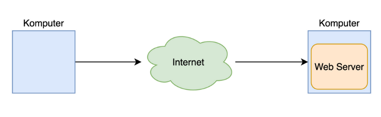
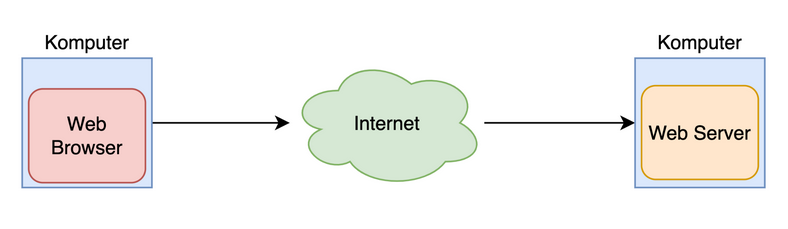
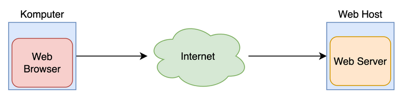

# HTML DASAR

## Table Of Contents

- [Pengenalan Web](#pengenalan-web)
- [Pengenalan HTML](#pengenalan-html)
- [Pengenalan Web Hosting](#pengenalan-web-hosting)
- [Penamaan File HTML](#penamaan-file-html)
- [Heading](#heading)
- [Paragraph](#paragraph)
- [Entities](#entities)
- [Break Line](#break-line)
- [Style](#style)
- [Formatting](#formatting)
- [Comment](#comment)
- [Color](#color)
- [List](#list)
- [Link](#link)
- [Image](#image)
- [Picture](#picture)
- [Computer Code](#computer-code)
- [Emoji](#emoji)
- [Head](#head)
- [Favicon](#favicon)
- [Block dan Inline](#block-dan-inline)
- [Video](#video)
- [Audio](#audio)
- [HTML 5](#html-5)
- [Inline Frame](#inline-frame)
- [Table](#table)
- [Semantic](#semantic)
- [Layout](#layout)
- [Responsive](#responsive)
- [ID](#id)

## Pengenalan Web

**Kenapa Web**

- Saat ini web digunakan oleh jutaan, bahkan mungkin milyaran orang setiap hari
- Dengan web, kita bisa melakukan belajar online, mendengarkan musik online, nonton video online, belanja online, sampai memesan makanan secara online
- Namun perlu diperhatikan, Web bukanlah Internet

**Internet**

- Internet adalah mekanisme komunikasi antar komputer
- Awal internet ada, untuk komunikasi antar komputer, kita membutuhkan jaringan kabel telepon
- Namun sekarang, semenjak berjamurnya jaringan wifi dan sejenisnya, komunikasi antar komputer menjadi lebih cepat dan mudah

**Web**

- Web merupakan kumpulan informasi yang tersedia dalam sebuah komputer yang terkoneksi secara terus menerus melalui internet
- Web bisa berisi informasi dalam bentuk apapun, seperti teks, gambar, audio, video dan lain-lain
- Web berjalan di aplikasi yang bernama Web Server, yaitu aplikasi yang digunakan untuk menyimpan dan menyampaikan isi informasi Web

**Diagram Web**



**Domain**

- Saat komputer Web terhubung ke internet, biasanya dia memiliki alamat
- Alamat ini bernama ip address, formatnya misal nya 172.217.194.94
- Karena alamat ip address sangat menyulitkan untuk diingat
- Untung saja ada yang namanya nama domain
- Nama domain adalah alamat yang bisa digunakan sebagai alias ke ip address
- Misal seperti niagahoster.com, google.com dan lain-lain
- Dengan nama domain, sebagai manusia kita akan mudah mengingat dibandingkan ip address
- Namun, saat kita menggunakan nama domain, sebenarnya komputer tetap akan mengakses web menggunakan alamat ip address

**Web Browser**

- Jika Web Server adalah aplikasi yang digunakan untuk menyimpan informasi Web
- Web Browser adalah aplikasi yang digunakan untuk mengakses Web melalui internet
- Kita bisa saja mengakses Web secara langsung tanpa bantuan Web Browser, namun Web Server hanya akan memberikan informasi bahasa mesin seperti HTML, JavaScript, CSS, Gambar, Video dan lain-lain
- Dengan menggunakan Web Browser, semua bahasa mesin tersebut bisa ditampilkan secara visual sehingga kita bisa menyerap informasinya dengan lebih mudah

**Diagram Web Browser**



## Pengenalan HTML

- HTML singkatan dari HyperText Markup Language, ini adalah adalah struktur dasar dari halaman web
- HTML mendeskripsikan struktur dari isi konten halaman Web
- Selain HTML, terdapat hal lain untuk mendeskripsikan sebuah halaman web, seperti untuk gaya tampilan halaman web menggunakan CSS atau interaksi halaman web menggunakan JavaScript
- HTML sendiri sebenarnya hanyalah kumpulan kode yang berisikan informasi halaman web
- Kode HTML akan dibaca oleh Web Browser untuk ditampilkan secara visual

**Kode HTML**

- Untuk melihat kode html, kita bisa buka website yang kita mau menggunakan Web Browser
- Lalu gunakan menu View Source di aplikasi Web Browser nya

**Tag**

- Kode HTML, berisikan kumpulan tag-tag yang kita buat
- Tag adalah perintah dalam html yang memiliki aturan pembuka dan penutup
- Ada banyak sekali tag di HTML, nanti kita akan pelajari satu per satu
- Contoh untuk membuat sebuah tulisan paragraf di HTML, kita bisa gunakan tag p, dimana penulisannya :

  ```html
  <p>Hello World</p>
  ```

- `<p>` diawal adalah tag pembuka, `</p>` di akhir adalah tag penutup. Dan `Hello World` adalah isi konten dari tag p
- Tag berisi kontennya bisa kita sebut dengan nama Element

**Void Element**

- Pada beberapa kasus, ada tag di HTML yang tidak perlu memiliki isi konten
- Hal ini bisa kita sebut dengan Void Element
- Contoh, di HTML terdapat Tag untuk membuat Break Line / Enter, dengan menggunakan tag `br`
- Karena tag br tidak memiliki konten, maka kita bisa gunakan perintah :

  ```html
  <br />
  atau <br />
  ```

- Tanpa harus menggunakan tag pembuka dan tag penutup

**Attribute**

- Element memiliki atribut. Atribut adalah informasi tambahan untuk tag yang kita gunakan
- Kita bisa tambahkan atribut di Element pada tag pembuka
- Contoh untuk menampilkan gambar di HTML, kita bisa menggunakan tag `` dengan atribut `src` yang berisikan lokasi gambar yang ingin kita tampilkan :

  ```html
  
  ```

- Attribute bisa digunakan di Element biasa atau di Void Element

**HTML Tidak Case Sensitive**

- Penulisan tag di HTML tidak case sensitive, artinya huruf besar atau kecil tidak masalah
- Namun sangat disarankan menggunakan huruf kecil semua, misal `<p>`, jangan `<P>`

**Contoh Kode HTML**

```html
<html>
  <head>
    <title>Judul Halaman</title>
  </head>
  <body>
    <h1>Hello World</h1>
  </body>
</html>
```

## Pengenalan Web Hosting

- Pemilik Web, biasanya tidak menjalankan aplikasi Web Server di komputer pribadi nya
- Biasanya mereka akan menyewa komputer di tempat penyedia data center (kumpulan komputer) yang terjamin keandalan dan kecepatan koneksi internetnya
- Pihak penyedia komputer untuk Web Server biasa disebut Web Host

**Diagram Web Host**



**Niagahoster**

- Niagahoster adalah salah satu Web Hosting yang terpercaya di Indonesia
- Niagahoster menyediakan berbagai layanan Web Hosting dan juga Domain
- Garansi 30 hari uang kembali kalau pelanggan tidak puas dengan layanan
- Yang paling penting adalah, Niagahoster menjamin uptime 99.99%, artinya website kita dijamin bisa selalu diakses kapanpun dimanapun
- Dan jika ada kendala, kita bisa chat ke customer service nya yang aktif 24 jam
- *https://www.niagahoster.co.id*

## Penamaan File HTML

- Sebenarnya tidak ada aturan dalam pembuatan nama file untuk HTML
- Kita bisa menggunakan nama file apapun, dan huruf besar dan kecil apapun
- Namun karena file HTML akan diakses sebagai URL pada web browser, misal : *www.google.com/namafile.html*
- Maka sangat disarankan mengikuti praktek yang baik penamaan URL

**Praktek Baik Penamaan File HTML**

- Jangan menggunakan huruf besar, selalu gunakan huruf kecil semua, misal :
  `index.html`, `home.html`, `belajar.html`, `haris.html`, dan lain-lain
- Jangan menggunakan spasi pada nama file, jika butuh pemisah, gunakan `-` atau `_`, misal :
  `belajar-html.html`, `halaman-login.html`, `belajar_html.html`
- Jika butuh membuat folder di gunakan aturan yang sama

**Heading**

- Saat kita membuat dokumen atau buku, biasanya terdapat Heading
- Heading adalah kata-kata yang mendeskripsikan isi dari tulisan yang kita buat.
- Seperti judul, tapi untuk bagian tulisan nya
- Contoh ketika kita melihat buku, Heading sering digunakan untuk tulisan Bab
- Di HTML, kita bisa membuat Heading dengan tag `h`

**Tingkatan Heading**

- Heading memiliki tingkatan, paling tinggi adalah tingkatan 1, selanjutnya tingkatan 2, 3, dan seterusnya
- Yang membedakan biasanya ukuran huruf nya akan semakin kecil
- Di HTML, kita bisa menggunakan tag `h1`, `h2`, `h3` dan seterusnya untuk menentukan tingkatan Heading
- HTML mendukung sampai heading tingkatan ke 6

**Kode Heading:**

```html
<h1>Heading 1</h1>
<h2>Heading 2</h2>
<h3>Heading 3</h3>
<h4>Heading 4</h4>
<h5>Heading 5</h5>
<h6>Heading 6</h6>

Tulisan B aja
```

## Paragraph

- Saat membuat tulisan, biasanya selain Heading (judul), kita juga biasanya membuat paragraf
- Di HTML, kita bisa menggunakan tag `p` untuk membuat paragraf
- Paragraf selalu mulai dengan baris baru

**Kode Paragraph:**

```html
<p>Ini adalah paragraph</p>
```

**Browser Menampilkan HTML**

- Kita tidak bisa mengontrol cara Web Browser menampilkan tulisan, seperti di Paragraph atau Heading misalnya
- Menambahkan enter atau spasi di tulisan, tidak akan menjadikan tampilannya seperti itu di Web Browser

## Entities

**Reserved Characters**

- Beberapa karakter sudah dipesan oleh HTML, sehingga kita tidak bisa digunakan pada tulisan teks biasa, contoh karakter `<`,`/`, atau `>`
- Oleh karena itu, jika kita memaksakan menuliskan hal tersebut di teks paragraf misal, secara otomatis halaman HTML akan error / rusak / tidak sesuai dengan yang kita mau

**Kode HTML Reserved Characters:**

```html
<html>
    <body>
        <h1>Belajar <HTML></h1>
    </body>
</html>
```

**Entities**

- Karakter yang sudah dipesan di HTML, dinamakan HTML Entity
- Ada banyak sekali HTML Entity, dan direkomendasikan untuk menggunakan simbol Entity nya, ketika kita ingin menggunakan karakter tersebut
- Tapi sebenarnya tidak wajib, kita tetap bisa menggunakan karakter asli, namun lebih aman jika menggunakan simbol Entity nya
- Kita bisa lihat seluruh daftar HTML Entity di :
- *https://oinam.github.io/entities/*
- *https://html.spec.whatwg.org/multipage/named-characters.html*

**Kode HTML Entities:**

```html
<html>
  <body>
    <h1>Belajar &#60;HTML&#62;</h1>
  </body>
</html>
```

## Break Line

- Seperti yang dibahas di materi Paragraph, enter di dalam tulisan tidak akan dianggap enter oleh HTML, jika kita ingin membuat enter, disarankan membuat paragraf terpisah
- Namun jika kita benar-benar ingin membuat enter di dalam paragraf, kita bisa menggunakan tag `br`
- Tag `br` adalah void element, jadi tidak memiliki konten

**Kode Break Line:**

```html
<p>
  Ini adalah paragraph baris awal
  <br />
  Ini adalah paragraph baris selanjutnya
</p>
```

**Horizontal Rule**

- Di HTML, kita juga bisa membuat enter dengan garis horizontal (dari kiri ke kanan) sebagai pemisah
- Untuk melakukannya, kita bisa menggunakan tag `hr`
- Tag hr juga merupakan void element, jadi tidak memiliki konten

**Kode Horizontal Rule:**

```html
<p>
  Ini adalah paragraph baris awal
  <br />
  Ini adalah paragraph baris selanjutnya
  <hr>
  Ini adalah baris selanjutnya dengan garis horizontal
</p>
```

## Style

**CSS (Cascading Style Sheet)**

- Sekarang kita sudah bisa membuat tulisan, pertanyaannya, bagaimana jika kita ingin mengubah font, ukurannya, dan warnanya
- Untuk melakukan itu, sebenarnya kita perlu belajar CSS terlebih dahulu

**Style Attribute**

- Setiap tag di HTML memiliki atribut style, dimana kita bisa menambahkan informasi CSS, yaitu untuk mengubah gaya isi element-nya
- Style attribute berisikan key:value CSS, jika lebih dari satu, maka gunakan `;` (titik koma) sebagai pemisah, misal :

  ```
  <namatag style=”property:value”>
  <namatag style=”property:value; property2:value2”>
  ```

**Contoh CSS**

- Berikut adalah contoh css atribut yang bisa kita gunakan, lebih lanjutnya akan kita bahas di kelas CSS
- `background-color` : untuk mengubah warna latar belakang
- `color` : untuk mengubah warna font
- `font-family` : untuk mengubah jenis font
- `font-size` : untuk mengubah ukuran text
- `text-align` : untuk mengubah rata tulisan secara horizontal, bisa left (kiri), right (kanan), center (tengah), justify (kiri dan kanan)

**Kode Style**

```html
<h1 style="color: red">Belajar HTML</h1>

<p style="background-color: gray">
  Mempelajari HTML Dasar membuat styling di html backgournd paragraph ini warna
  abu-abu
</p>

<p style="color: blue; font-size: 20px; font-family: arial">
  Paragraph ini memiliki warna biru, ukuran font 20px, dan font-family arial
</p>
```

## Formatting

- Dalam aplikasi pengolahan text seperti Microsoft Word, kita bisa mengubah format tulisan menjadi tebal atau miring misal
- Begitu juga di HTML, kita bisa menambah formating di text yang ingin kita tampilkan menggunakan tag sesuai dengan format yang kita mau

**Formatting Tag**

- `<br>`, `<strong>` (untuk bold / tebal)
- `<i>`, `<em>` (untuk italic / miring)
- `<small>` (untuk text kecil)
- `<del>` (untuk text dicoret)
- `<ins>` (untuk text dengan garis bawah)
- `<sub>` (untuk subscript text)
- `<sup>` (untuk superscript text)

**Kode Formatting Tag:**

```html
<p>
  Halo <b>Ucup</b>, Selamat Belajar <i>HTML</i> dengan
  <strong>Github haris2303</strong>
</p>

<p>Jangan <del>minder</del> ya, tetap <ins>Semangat</ins></p>

<p>2<sup>2</sup> = 4</p>
```

## Comment

- Comment / komentar adalah informasi tambahan di HTML, yang tidak akan ditampilkan di halaman Web
- Komentar biasanya digunakan untuk menambahkan informasi tambahan untuk pengembang Web, jadi bukan tujuan untuk ditampilkan di halaman Web
- Untuk membuat komentar, kita bisa menggunakan
  `<!-- isi komentar -->`
- Semua yang ada di isi komentar tidak akan ditampilkan, termasuk tag HTML

**Kode Comment:**

```html
<h1>Belajar HTML</h1>
<!-- Ini adalah sebuah komentar, apapun yang ada di tag ini tidak akan muncul di halaman web -->
<p>Ini Muncul</p>
```

## Color

- HTML mendukung format penulisan warna tidak hanya dengan nama warna nya (`red`, `blue`, `green`, dll), namun juga dengan format penulisan seperti `HEX`, `RGB`, `HSL` dan lain-lain
- Dengan begitu, penulisan warna jadi lebih akurat dibandingkan hanya dengan nama warna nya

**Color Picker**

- Salah satu website yang bisa kita gunakan untuk memilih warna adalah : *https://colorpicker.me/*
- Disana kita bisa mencari warna yang kita mau, dan menyalin kode Hex untuk warna tersebut

**Kode Color:**

```html
<h1 style="background-color: #da18a0;">Belajar HTML</h1>
<h1 style="background-color: rbg(25, 200, 90);">Bersama Sama</h1>
<h1 style="background-color: hsl(120, 60%, 52%);">Tetap Semangant Yachh</h1>
```

## List

**Unordered List**

- Untuk membuat daftar tulisan, kita bisa menggunakan tag `ul` di HTML
- Tiap daftar isi nya, kita bisa menggunakan tag `li`

**Kode Unordered List:**

```html
<h3>Daftar Kegiatan</h3>

<ul>
  <li>Main Game</li>
  <li>Olahraga</li>
  <li>Makan</li>
  <li>Tidur</li>
</ul>
```

**Ordered List**

- Jika kita ingin membuat daftar yang berurut (memiliki angka), kita bisa mengganti tag `ul` menjadi `ol`
- Untuk daftar isi nya tetap sama menggunakan tag `li`

**Kode Ordered List:**

```html
<h2>Tahapan Belajar HTML</h2>

<ol>
  <li>Mengenal Web</li>
  <li>Mengintall Aplikasi Editor Code</li>
  <li>Mempelajari Tag HTML</li>
  <li>Menghosting Web</li>
</ol>
```

**Ordered List Type**

- Pada kasus ketika kita menggunakan daftar yang berurut (`ol`), kita bisa mengubah format daftar nya, defaultnya menggunakan angka (dimulai dari 1).
- Kita bisa menambahkan attribute type di ol dengan nilai :
- `type=”1”`, artinya daftar isi akan menggunakan angka (ini adalah defaultnya)
- `type=”A”`, artinya daftar isi akan menggunakan huruf kapital
- `type=”a”`, artinya daftar isi akan menggunakan huruf kecil
- `type=”I”`, artinya daftar isi akan menggunakan angka romawi kapital
- `type=”i”`, artinya daftar isi akan menggunakan angka romawi kecil

**Kode Ordered List Type:**

```html
<ol type="a">
  <li>Mengenal Web</li>
  <li>Mengintall Aplikasi Editor Code</li>
  <li>Mempelajari Tag HTML</li>
  <li>Menghosting Web</li>
</ol>
```

## Link

- Saat membuat Web, biasanya kita akan membuat banyak sekali halaman HTML
- Untuk berpindah dari satu halaman ke halaman lain, kita biasanya jarang melakukannya secara manual dengan cara mengetikkannya di search bar Web Browser
- HTML memiliki fitur Link (Tautan), dimana kita bisa meng-klik Link tersebut, dan berpindah ke halaman HTML lain
- Link tidak harus dalam bentuk Text, Link juga bisa dalam bentuk Gambar misalnya (yang akan kita bahas di materi Image)

**Tag a**

- Untuk membuat Link di HTML, kita bisa menggunakan tag `a`
- Isi konten tag `a` adalah isi dari tampilan Link, bisa Text atau yang lainnya
- Tag `a` memiliki attribute `href`, yang berisi lokasi tujuan Link tersebut
- Tag a juga memiliki attribute target, yang digunakan sebagai target jendela Web Browser, kita bisa gunakan nilai :

  `target=”_self”`, artinya halaman akan ditampilkan di halaman yang sama, ini adalah bawaan default
  `target=”_blank”`, artinya halaman akan ditampilkan di jendela baru di Browser

- Tag `a` juga memiliki attribute `title`, untuk menuliskan judul yang keluar ketika mouse berada di atas Link tersebut

**Kode Link:**

```html
<h1>Belajar Link</h1>

<ul>
  <li><a href="https://facebook.com" target="_blank">Facebook</a></li>
  <li><a href="https://instagram.com" target="_blank">Instagram</a></li>
  <li><a href="https://youtube.com" target="_blank">Youtube</a></li>
</ul>
```

**Abosolute URL**

- Saat kita menulis halaman tujuan dari href di Link, kita bisa menggunakan absolute URL
- Absolute URL merupakan alamat lengkap sebuah tujuan Link
- Dalam absolute URL, kita wajib menuliskan seluruh detail domain dan halaman yang dituju, misal
- https://youtube.com
- Kelebihan menggunakan Absolute URL adalah, kita bisa membuat Link menuju domain yang berbeda dengan website yang kita buat

**Relative URL**

- Relative URL adalah lokasi href dimana tetap menggunakan domain website saat ini
- Relative URL memiliki dua format, bisa diawali dengan `/`, atau tidak diawali dengan `/`
- Misal sekarang kita berada di halaman http://127.0.0.1/belajar-link/index.html , lalu kita memiliki link sebagai berikut :
- `hello.html`, artinya akan menuju ke http://127.0.0.1/belajar-link/hello.html
- `/hello.html`, artinya akan menuju ke http://127.0.0.1/hello.html

**Kode Relative URL:**

```html
<h1>Belajar Relative URL</h1>
<ul>
  <li><a href="hello.html">Hello HTML</a></li>
  <li><a href="belajar/web.html">Belajar HTML</a></li>
</ul>
```

**Bookmark**

- Pada kasus halaman web yang sangat panjang, ada bagusnya kita menggunakan Bookmark
- Bookmark adalah link yang bisa digunakan untuk menampilkan HTML element dengan `id` tertentu
- Bookmark menggunakan `#` pada href, misal jika kita menggunakan `index.html#about`, artinya ketika membuka halaman `index.html`, maka Web Browser akan otomatis menampilkan pada posisi HTML Element dengan `id about`
- Jika kita ingin membuat link di halaman HTML itu sendiri, kita bisa langsung buat Link dengan href langsung berisi #bookmark nya

**Kode Bookmark di Halaman Sendiri:**

```html
<h1>Daftar Isi</h1>
<ul>
  <li><a href="#about">About</a></li>
  <li><a href="#profile">Profile</a></li>
</ul>

<h2 id="about">About</h2>
<p>Belajar HTML sangat penting jika kita ingin membuat Web</p>
```

## Image

- Image / gambar bisa digunakan untuk memperindah tampilan website yang kita buat
- HTML mendukung untuk menampilkan gambar dengan tag `img`
- Hampir semua format gambar yang didukung oleh Web Browser, bisa ditampilkan di halaman web HTML

**Image Attribute**

- Tag img adalah void element, jadi tidak memiliki konten
- Terdapat beberapa atribut yang bisa kita gunakan dalam tag `img`
- Attribute `src` yang digunakan untuk menentukan lokasi gambar yang mau ditampilkan, bisa menggunakan Absolute URL atau Relative URL
- Attribute alt yang digunakan sebagai representasi text atau tulisan untuk gambar

**Kode Image:**

```html

```

**Image Size**

- Secara bawaan default, ukuran gambar akan selalu ditampilkan sesuai aslinya
- Kadang-kadang, kita ingin mengubah ukuran gambarnya
- Untuk melakukan itu, kita perlu batuan CSS
- Kita bisa gunakan attribute CSS :
- width untuk mengubah ukuran lebar
- height untuk mengubah ukuran tinggi
- Kita bisa gunakan satuan px (pixel), atau % untuk persentase dari ukuran asli

**Kode Image Size:**

```html

```

> Source Material from [Programmer Zaman Now](https://programmerzamannow)
