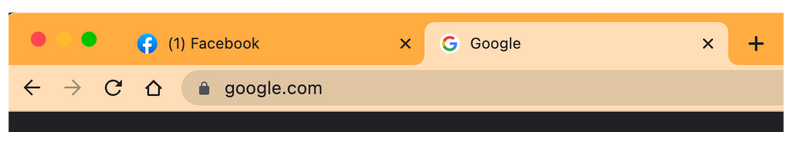
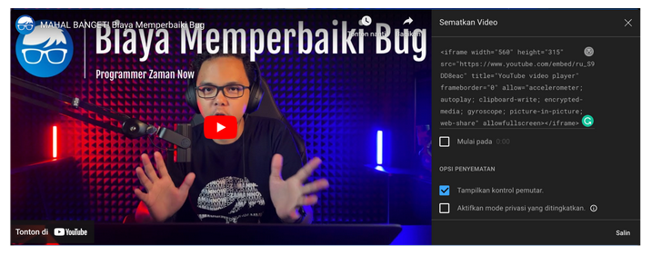
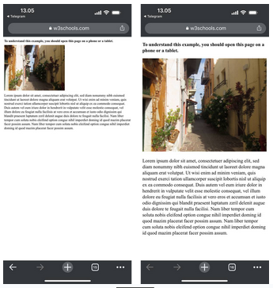

# HTML DASAR

## Table Of Contents

- [Pengenalan Web](#pengenalan-web)
- [Pengenalan HTML](#pengenalan-html)
- [Pengenalan Web Hosting](#pengenalan-web-hosting)
- [Penamaan File HTML](#penamaan-file-html)
- [Heading](#heading)
- [Paragraph](#paragraph)
- [Entities](#entities)
- [Break Line](#break-line)
- [Style](#style)
- [Formatting](#formatting)
- [Comment](#comment)
- [Color](#color)
- [List](#list)
- [Link](#link)
- [Image](#image)
- [Picture](#picture)
- [Computer Code](#computer-code)
- [Emoji](#emoji)
- [Head](#head)
- [Favicon](#favicon)
- [Block dan Inline](#block-dan-inline)
- [Video](#video)
- [Audio](#audio)
- [HTML 5](#html-5)
- [Inline Frame](#inline-frame)
- [Table](#table)
- [Semantic](#semantic)
- [Layout](#layout)
- [Responsive](#responsive)
- [ID](#id)

## Pengenalan Web

**Kenapa Web**

- Saat ini web digunakan oleh jutaan, bahkan mungkin milyaran orang setiap hari
- Dengan web, kita bisa melakukan belajar online, mendengarkan musik online, nonton video online, belanja online, sampai memesan makanan secara online
- Namun perlu diperhatikan, Web bukanlah Internet

**Internet**

- Internet adalah mekanisme komunikasi antar komputer
- Awal internet ada, untuk komunikasi antar komputer, kita membutuhkan jaringan kabel telepon
- Namun sekarang, semenjak berjamurnya jaringan wifi dan sejenisnya, komunikasi antar komputer menjadi lebih cepat dan mudah

**Web**

- Web merupakan kumpulan informasi yang tersedia dalam sebuah komputer yang terkoneksi secara terus menerus melalui internet
- Web bisa berisi informasi dalam bentuk apapun, seperti teks, gambar, audio, video dan lain-lain
- Web berjalan di aplikasi yang bernama Web Server, yaitu aplikasi yang digunakan untuk menyimpan dan menyampaikan isi informasi Web

**Diagram Web**


**Domain**

- Saat komputer Web terhubung ke internet, biasanya dia memiliki alamat
- Alamat ini bernama ip address, formatnya misal nya 172.217.194.94
- Karena alamat ip address sangat menyulitkan untuk diingat
- Untung saja ada yang namanya nama domain
- Nama domain adalah alamat yang bisa digunakan sebagai alias ke ip address
- Misal seperti niagahoster.com, google.com dan lain-lain
- Dengan nama domain, sebagai manusia kita akan mudah mengingat dibandingkan ip address
- Namun, saat kita menggunakan nama domain, sebenarnya komputer tetap akan mengakses web menggunakan alamat ip address

**Web Browser**

- Jika Web Server adalah aplikasi yang digunakan untuk menyimpan informasi Web
- Web Browser adalah aplikasi yang digunakan untuk mengakses Web melalui internet
- Kita bisa saja mengakses Web secara langsung tanpa bantuan Web Browser, namun Web Server hanya akan memberikan informasi bahasa mesin seperti HTML, JavaScript, CSS, Gambar, Video dan lain-lain
- Dengan menggunakan Web Browser, semua bahasa mesin tersebut bisa ditampilkan secara visual sehingga kita bisa menyerap informasinya dengan lebih mudah

**Diagram Web Browser**


## Pengenalan HTML

- HTML singkatan dari HyperText Markup Language, ini adalah adalah struktur dasar dari halaman web
- HTML mendeskripsikan struktur dari isi konten halaman Web
- Selain HTML, terdapat hal lain untuk mendeskripsikan sebuah halaman web, seperti untuk gaya tampilan halaman web menggunakan CSS atau interaksi halaman web menggunakan JavaScript
- HTML sendiri sebenarnya hanyalah kumpulan kode yang berisikan informasi halaman web
- Kode HTML akan dibaca oleh Web Browser untuk ditampilkan secara visual

**Kode HTML**

- Untuk melihat kode html, kita bisa buka website yang kita mau menggunakan Web Browser
- Lalu gunakan menu View Source di aplikasi Web Browser nya

**Tag**

- Kode HTML, berisikan kumpulan tag-tag yang kita buat
- Tag adalah perintah dalam html yang memiliki aturan pembuka dan penutup
- Ada banyak sekali tag di HTML, nanti kita akan pelajari satu per satu
- Contoh untuk membuat sebuah tulisan paragraf di HTML, kita bisa gunakan tag p, dimana penulisannya :

  ```html
  <p>Hello World</p>
  ```

- `<p>` diawal adalah tag pembuka, `</p>` di akhir adalah tag penutup. Dan `Hello World` adalah isi konten dari tag p
- Tag berisi kontennya bisa kita sebut dengan nama Element

**Void Element**

- Pada beberapa kasus, ada tag di HTML yang tidak perlu memiliki isi konten
- Hal ini bisa kita sebut dengan Void Element
- Contoh, di HTML terdapat Tag untuk membuat Break Line / Enter, dengan menggunakan tag `br`
- Karena tag br tidak memiliki konten, maka kita bisa gunakan perintah :

  ```html
  <br />
  atau <br />
  ```

- Tanpa harus menggunakan tag pembuka dan tag penutup

**Attribute**

- Element memiliki atribut. Atribut adalah informasi tambahan untuk tag yang kita gunakan
- Kita bisa tambahkan atribut di Element pada tag pembuka
- Contoh untuk menampilkan gambar di HTML, kita bisa menggunakan tag `` dengan atribut `src` yang berisikan lokasi gambar yang ingin kita tampilkan :

  ```html
  
  ```

- Attribute bisa digunakan di Element biasa atau di Void Element

**HTML Tidak Case Sensitive**

- Penulisan tag di HTML tidak case sensitive, artinya huruf besar atau kecil tidak masalah
- Namun sangat disarankan menggunakan huruf kecil semua, misal `<p>`, jangan `<P>`

**Contoh Kode HTML**

```html
<html>
  <head>
    <title>Judul Halaman</title>
  </head>
  <body>
    <h1>Hello World</h1>
  </body>
</html>
```

## Pengenalan Web Hosting

- Pemilik Web, biasanya tidak menjalankan aplikasi Web Server di komputer pribadi nya
- Biasanya mereka akan menyewa komputer di tempat penyedia data center (kumpulan komputer) yang terjamin keandalan dan kecepatan koneksi internetnya
- Pihak penyedia komputer untuk Web Server biasa disebut Web Host

**Diagram Web Host**


**Niagahoster**

- Niagahoster adalah salah satu Web Hosting yang terpercaya di Indonesia
- Niagahoster menyediakan berbagai layanan Web Hosting dan juga Domain
- Garansi 30 hari uang kembali kalau pelanggan tidak puas dengan layanan
- Yang paling penting adalah, Niagahoster menjamin uptime 99.99%, artinya website kita dijamin bisa selalu diakses kapanpun dimanapun
- Dan jika ada kendala, kita bisa chat ke customer service nya yang aktif 24 jam
- *https://www.niagahoster.co.id*

## Penamaan File HTML

- Sebenarnya tidak ada aturan dalam pembuatan nama file untuk HTML
- Kita bisa menggunakan nama file apapun, dan huruf besar dan kecil apapun
- Namun karena file HTML akan diakses sebagai URL pada web browser, misal : *www.google.com/namafile.html*
- Maka sangat disarankan mengikuti praktek yang baik penamaan URL

**Praktek Baik Penamaan File HTML**

- Jangan menggunakan huruf besar, selalu gunakan huruf kecil semua, misal :
  `index.html`, `home.html`, `belajar.html`, `haris.html`, dan lain-lain
- Jangan menggunakan spasi pada nama file, jika butuh pemisah, gunakan `-` atau `_`, misal :
  `belajar-html.html`, `halaman-login.html`, `belajar_html.html`
- Jika butuh membuat folder di gunakan aturan yang sama

**Heading**

- Saat kita membuat dokumen atau buku, biasanya terdapat Heading
- Heading adalah kata-kata yang mendeskripsikan isi dari tulisan yang kita buat.
- Seperti judul, tapi untuk bagian tulisan nya
- Contoh ketika kita melihat buku, Heading sering digunakan untuk tulisan Bab
- Di HTML, kita bisa membuat Heading dengan tag `h`

**Tingkatan Heading**

- Heading memiliki tingkatan, paling tinggi adalah tingkatan 1, selanjutnya tingkatan 2, 3, dan seterusnya
- Yang membedakan biasanya ukuran huruf nya akan semakin kecil
- Di HTML, kita bisa menggunakan tag `h1`, `h2`, `h3` dan seterusnya untuk menentukan tingkatan Heading
- HTML mendukung sampai heading tingkatan ke 6

**Kode Heading:**

```html
<h1>Heading 1</h1>
<h2>Heading 2</h2>
<h3>Heading 3</h3>
<h4>Heading 4</h4>
<h5>Heading 5</h5>
<h6>Heading 6</h6>

Tulisan B aja
```

## Paragraph

- Saat membuat tulisan, biasanya selain Heading (judul), kita juga biasanya membuat paragraf
- Di HTML, kita bisa menggunakan tag `p` untuk membuat paragraf
- Paragraf selalu mulai dengan baris baru

**Kode Paragraph:**

```html
<p>Ini adalah paragraph</p>
```

**Browser Menampilkan HTML**

- Kita tidak bisa mengontrol cara Web Browser menampilkan tulisan, seperti di Paragraph atau Heading misalnya
- Menambahkan enter atau spasi di tulisan, tidak akan menjadikan tampilannya seperti itu di Web Browser

## Entities

**Reserved Characters**

- Beberapa karakter sudah dipesan oleh HTML, sehingga kita tidak bisa digunakan pada tulisan teks biasa, contoh karakter `<`,`/`, atau `>`
- Oleh karena itu, jika kita memaksakan menuliskan hal tersebut di teks paragraf misal, secara otomatis halaman HTML akan error / rusak / tidak sesuai dengan yang kita mau

**Kode HTML Reserved Characters:**

```html
<html>
    <body>
        <h1>Belajar <HTML></h1>
    </body>
</html>
```

**Entities**

- Karakter yang sudah dipesan di HTML, dinamakan HTML Entity
- Ada banyak sekali HTML Entity, dan direkomendasikan untuk menggunakan simbol Entity nya, ketika kita ingin menggunakan karakter tersebut
- Tapi sebenarnya tidak wajib, kita tetap bisa menggunakan karakter asli, namun lebih aman jika menggunakan simbol Entity nya
- Kita bisa lihat seluruh daftar HTML Entity di :
- *https://oinam.github.io/entities/*
- *https://html.spec.whatwg.org/multipage/named-characters.html*

**Kode HTML Entities:**

```html
<html>
  <body>
    <h1>Belajar &#60;HTML&#62;</h1>
  </body>
</html>
```

## Break Line

- Seperti yang dibahas di materi Paragraph, enter di dalam tulisan tidak akan dianggap enter oleh HTML, jika kita ingin membuat enter, disarankan membuat paragraf terpisah
- Namun jika kita benar-benar ingin membuat enter di dalam paragraf, kita bisa menggunakan tag `br`
- Tag `br` adalah void element, jadi tidak memiliki konten

**Kode Break Line:**

```html
<p>
  Ini adalah paragraph baris awal
  <br />
  Ini adalah paragraph baris selanjutnya
</p>
```

**Horizontal Rule**

- Di HTML, kita juga bisa membuat enter dengan garis horizontal (dari kiri ke kanan) sebagai pemisah
- Untuk melakukannya, kita bisa menggunakan tag `hr`
- Tag hr juga merupakan void element, jadi tidak memiliki konten

**Kode Horizontal Rule:**

```html
<p>
  Ini adalah paragraph baris awal
  <br />
  Ini adalah paragraph baris selanjutnya
  <hr>
  Ini adalah baris selanjutnya dengan garis horizontal
</p>
```

## Style

**CSS (Cascading Style Sheet)**

- Sekarang kita sudah bisa membuat tulisan, pertanyaannya, bagaimana jika kita ingin mengubah font, ukurannya, dan warnanya
- Untuk melakukan itu, sebenarnya kita perlu belajar CSS terlebih dahulu

**Style Attribute**

- Setiap tag di HTML memiliki atribut style, dimana kita bisa menambahkan informasi CSS, yaitu untuk mengubah gaya isi element-nya
- Style attribute berisikan key:value CSS, jika lebih dari satu, maka gunakan `;` (titik koma) sebagai pemisah, misal :

  ```
  <namatag style=”property:value”>
  <namatag style=”property:value; property2:value2”>
  ```

**Contoh CSS**

- Berikut adalah contoh css atribut yang bisa kita gunakan, lebih lanjutnya akan kita bahas di kelas CSS
- `background-color` : untuk mengubah warna latar belakang
- `color` : untuk mengubah warna font
- `font-family` : untuk mengubah jenis font
- `font-size` : untuk mengubah ukuran text
- `text-align` : untuk mengubah rata tulisan secara horizontal, bisa left (kiri), right (kanan), center (tengah), justify (kiri dan kanan)

**Kode Style**

```html
<h1 style="color: red">Belajar HTML</h1>

<p style="background-color: gray">
  Mempelajari HTML Dasar membuat styling di html backgournd paragraph ini warna
  abu-abu
</p>

<p style="color: blue; font-size: 20px; font-family: arial">
  Paragraph ini memiliki warna biru, ukuran font 20px, dan font-family arial
</p>
```

## Formatting

- Dalam aplikasi pengolahan text seperti Microsoft Word, kita bisa mengubah format tulisan menjadi tebal atau miring misal
- Begitu juga di HTML, kita bisa menambah formating di text yang ingin kita tampilkan menggunakan tag sesuai dengan format yang kita mau

**Formatting Tag**

- `<br>`, `<strong>` (untuk bold / tebal)
- `<i>`, `<em>` (untuk italic / miring)
- `<small>` (untuk text kecil)
- `<del>` (untuk text dicoret)
- `<ins>` (untuk text dengan garis bawah)
- `<sub>` (untuk subscript text)
- `<sup>` (untuk superscript text)

**Kode Formatting Tag:**

```html
<p>
  Halo <b>Ucup</b>, Selamat Belajar <i>HTML</i> dengan
  <strong>Github haris2303</strong>
</p>

<p>Jangan <del>minder</del> ya, tetap <ins>Semangat</ins></p>

<p>2<sup>2</sup> = 4</p>
```

## Comment

- Comment / komentar adalah informasi tambahan di HTML, yang tidak akan ditampilkan di halaman Web
- Komentar biasanya digunakan untuk menambahkan informasi tambahan untuk pengembang Web, jadi bukan tujuan untuk ditampilkan di halaman Web
- Untuk membuat komentar, kita bisa menggunakan
  `<!-- isi komentar -->`
- Semua yang ada di isi komentar tidak akan ditampilkan, termasuk tag HTML

**Kode Comment:**

```html
<h1>Belajar HTML</h1>
<!-- Ini adalah sebuah komentar, apapun yang ada di tag ini tidak akan muncul di halaman web -->
<p>Ini Muncul</p>
```

## Color

- HTML mendukung format penulisan warna tidak hanya dengan nama warna nya (`red`, `blue`, `green`, dll), namun juga dengan format penulisan seperti `HEX`, `RGB`, `HSL` dan lain-lain
- Dengan begitu, penulisan warna jadi lebih akurat dibandingkan hanya dengan nama warna nya

**Color Picker**

- Salah satu website yang bisa kita gunakan untuk memilih warna adalah : *https://colorpicker.me/*
- Disana kita bisa mencari warna yang kita mau, dan menyalin kode Hex untuk warna tersebut

**Kode Color:**

```html
<h1 style="background-color: #da18a0;">Belajar HTML</h1>
<h1 style="background-color: rbg(25, 200, 90);">Bersama Sama</h1>
<h1 style="background-color: hsl(120, 60%, 52%);">Tetap Semangant Yachh</h1>
```

## List

**Unordered List**

- Untuk membuat daftar tulisan, kita bisa menggunakan tag `ul` di HTML
- Tiap daftar isi nya, kita bisa menggunakan tag `li`

**Kode Unordered List:**

```html
<h3>Daftar Kegiatan</h3>

<ul>
  <li>Main Game</li>
  <li>Olahraga</li>
  <li>Makan</li>
  <li>Tidur</li>
</ul>
```

**Ordered List**

- Jika kita ingin membuat daftar yang berurut (memiliki angka), kita bisa mengganti tag `ul` menjadi `ol`
- Untuk daftar isi nya tetap sama menggunakan tag `li`

**Kode Ordered List:**

```html
<h2>Tahapan Belajar HTML</h2>

<ol>
  <li>Mengenal Web</li>
  <li>Mengintall Aplikasi Editor Code</li>
  <li>Mempelajari Tag HTML</li>
  <li>Menghosting Web</li>
</ol>
```

**Ordered List Type**

- Pada kasus ketika kita menggunakan daftar yang berurut (`ol`), kita bisa mengubah format daftar nya, defaultnya menggunakan angka (dimulai dari 1).
- Kita bisa menambahkan attribute type di ol dengan nilai :
- `type=”1”`, artinya daftar isi akan menggunakan angka (ini adalah defaultnya)
- `type=”A”`, artinya daftar isi akan menggunakan huruf kapital
- `type=”a”`, artinya daftar isi akan menggunakan huruf kecil
- `type=”I”`, artinya daftar isi akan menggunakan angka romawi kapital
- `type=”i”`, artinya daftar isi akan menggunakan angka romawi kecil

**Kode Ordered List Type:**

```html
<ol type="a">
  <li>Mengenal Web</li>
  <li>Mengintall Aplikasi Editor Code</li>
  <li>Mempelajari Tag HTML</li>
  <li>Menghosting Web</li>
</ol>
```

## Link

- Saat membuat Web, biasanya kita akan membuat banyak sekali halaman HTML
- Untuk berpindah dari satu halaman ke halaman lain, kita biasanya jarang melakukannya secara manual dengan cara mengetikkannya di search bar Web Browser
- HTML memiliki fitur Link (Tautan), dimana kita bisa meng-klik Link tersebut, dan berpindah ke halaman HTML lain
- Link tidak harus dalam bentuk Text, Link juga bisa dalam bentuk Gambar misalnya (yang akan kita bahas di materi Image)

**Tag a**

- Untuk membuat Link di HTML, kita bisa menggunakan tag `a`
- Isi konten tag `a` adalah isi dari tampilan Link, bisa Text atau yang lainnya
- Tag `a` memiliki attribute `href`, yang berisi lokasi tujuan Link tersebut
- Tag a juga memiliki attribute target, yang digunakan sebagai target jendela Web Browser, kita bisa gunakan nilai :

  `target=”_self”`, artinya halaman akan ditampilkan di halaman yang sama, ini adalah bawaan default
  `target=”_blank”`, artinya halaman akan ditampilkan di jendela baru di Browser

- Tag `a` juga memiliki attribute `title`, untuk menuliskan judul yang keluar ketika mouse berada di atas Link tersebut

**Kode Link:**

```html
<h1>Belajar Link</h1>

<ul>
  <li><a href="https://facebook.com" target="_blank">Facebook</a></li>
  <li><a href="https://instagram.com" target="_blank">Instagram</a></li>
  <li><a href="https://youtube.com" target="_blank">Youtube</a></li>
</ul>
```

**Abosolute URL**

- Saat kita menulis halaman tujuan dari href di Link, kita bisa menggunakan absolute URL
- Absolute URL merupakan alamat lengkap sebuah tujuan Link
- Dalam absolute URL, kita wajib menuliskan seluruh detail domain dan halaman yang dituju, misal
- https://youtube.com
- Kelebihan menggunakan Absolute URL adalah, kita bisa membuat Link menuju domain yang berbeda dengan website yang kita buat

**Relative URL**

- Relative URL adalah lokasi href dimana tetap menggunakan domain website saat ini
- Relative URL memiliki dua format, bisa diawali dengan `/`, atau tidak diawali dengan `/`
- Misal sekarang kita berada di halaman http://127.0.0.1/belajar-link/index.html , lalu kita memiliki link sebagai berikut :
- `hello.html`, artinya akan menuju ke http://127.0.0.1/belajar-link/hello.html
- `/hello.html`, artinya akan menuju ke http://127.0.0.1/hello.html

**Kode Relative URL:**

```html
<h1>Belajar Relative URL</h1>
<ul>
  <li><a href="hello.html">Hello HTML</a></li>
  <li><a href="belajar/web.html">Belajar HTML</a></li>
</ul>
```

**Bookmark**

- Pada kasus halaman web yang sangat panjang, ada bagusnya kita menggunakan Bookmark
- Bookmark adalah link yang bisa digunakan untuk menampilkan HTML element dengan `id` tertentu
- Bookmark menggunakan `#` pada href, misal jika kita menggunakan `index.html#about`, artinya ketika membuka halaman `index.html`, maka Web Browser akan otomatis menampilkan pada posisi HTML Element dengan `id about`
- Jika kita ingin membuat link di halaman HTML itu sendiri, kita bisa langsung buat Link dengan href langsung berisi #bookmark nya

**Kode Bookmark di Halaman Sendiri:**

```html
<h1>Daftar Isi</h1>
<ul>
  <li><a href="#about">About</a></li>
  <li><a href="#profile">Profile</a></li>
</ul>

<h2 id="about">About</h2>
<p>Belajar HTML sangat penting jika kita ingin membuat Web</p>
```

## Image

- Image / gambar bisa digunakan untuk memperindah tampilan website yang kita buat
- HTML mendukung untuk menampilkan gambar dengan tag `img`
- Hampir semua format gambar yang didukung oleh Web Browser, bisa ditampilkan di halaman web HTML

**Image Attribute**

- Tag img adalah void element, jadi tidak memiliki konten
- Terdapat beberapa atribut yang bisa kita gunakan dalam tag `img`
- Attribute `src` yang digunakan untuk menentukan lokasi gambar yang mau ditampilkan, bisa menggunakan Absolute URL atau Relative URL
- Attribute alt yang digunakan sebagai representasi text atau tulisan untuk gambar

**Kode Image:**

```html

```

**Image Size**

- Secara bawaan default, ukuran gambar akan selalu ditampilkan sesuai aslinya
- Kadang-kadang, kita ingin mengubah ukuran gambarnya
- Untuk melakukan itu, kita perlu batuan CSS
- Kita bisa gunakan attribute CSS :
- width untuk mengubah ukuran lebar
- height untuk mengubah ukuran tinggi
- Kita bisa gunakan satuan px (pixel), atau % untuk persentase dari ukuran asli

**Kode Image Size:**

```html

```

## Picture

- Selain untuk menampilkan gambar menggunakan tag `img`, di HTML juga bisa menggunakan tag `picture` untuk menampilkan gambar
- Salah satu keuntungan menggunakan tag `picture` adalah, kita bisa menggunakan beberapa lokasi gambar, dan bisa diatur sesuai dengan ukuran layar misalnya. Jadi ketika di layar besar, kita bisa kirim gambar dengan ukuran besar, dan ketika di layar kecil, kita bisa kirim gambar yang ukuran kecil

**Picture Content**

- Tag `img` adalah void element, sedangkan Tag `picture` bukan
- Di dalam tag `picture`, kita bisa menambahkan tag source yang berisi lokasi gambar, dan tag `img` sebagai default gambar ketika semua kondisi tag source tidak terpenuhi

**Kode Picture:**

```html
<picture>
  <source media="(max-width: 300px)" srcset="tayo.jpg" alt="Tayo" />
  
</picture>
```

## Computer Code

- Sebagai programmer, kadang kita sering membuat web artikel tentang kode program
- Pada kasus seperti ini, ketika kita membuat kode program di HTML menggunakan paragraph, maka akan menyulitkan, karena semua enter dan spasi akan dinormalkan oleh HTML
- Kadang kita ingin menampilkan kodenya apa adanya

**Tag Pre**

- Untuk menampilkan tulisan di dalam HTML apa adanya, kita bisa menggunakan tag `pre`
- Namun perlu diingat, kode HTML tetap tidak akan ditampilkan, jadi kita harus menggunakan HTML Entities

**Kode Pre:**

```html
<pre>
  public static void main(String[] args) {
    System.out.println("HELLO WORLD");
  }
</pre>
```

## Emoji

- Dalam website, kita sering sekali melihat emoji pada tulisan
- Bagaimana cara membuat emoji di HTML?
- HTML sudah memiliki standar untuk membuat emoji, mirip dengan HTML Entities, kita juga bisa menggunakan kode untuk membuat Emoji
- Kita bisa melihat daftar emoji yang dapat kita gunakan, dan kodenya disini :
  *https://www.quackit.com/character_sets/emoji/emoji_v3.0/unicode_emoji_v3.0_characters_all.cfm*

**Kode Emoji:**

```html
<h3>Hello &#1F923; &#x1F633</h3>
```

## Head

- Selain tag `body`, di HTML juga terdapat tag `head`
- Tag head digunakan untuk menambah informasi yang tidak dimunculkan di halaman web
- Head biasanya digunakan untuk menambah informasi seperti CSS atau JavaScript
- Head juga biasa digunakan untuk menambahkan metadata (informasi tambahan) untuk halaman HTML, biasanya digunakan oleh Search Engine misalnya

**Title**

- Di dalam Head, kita juga bisa menambahkan tag `title`, yang digunakan untuk mengubah judul halaman di Web Browser

**Kode Title:**

```html
<head>
  <title>Belajar HTML</title>
</head>
```

## Favicon

- Saat kita membuka website seperti Google, Facebook atau yang lainnya, biasanya pada bagian tab Web Browser, terdapat logo perusahaannya
- Bagaimana cara membuatnya? Itu adalah fitur Favicon di HTML

**Tag Link**

- Untuk membuat favicon, kita bisa menggunakan tag link pada bagian head
- dimana dalam link kita perlu menggunakan atribut `rel=”icon”` dan href menuju lokasi gambar icon
- Gambar icon bisa file berupa ico, png, jpg, svg atau gif

  

**Kode Favicon:**

```html
<head>
  <title>Belajar Favicon</title>
  <link rel="icon" href="gambar.jpg" />
</head>
```

## Block dan Inline

- Di dalam HTML, semua element memiliki nilai display, tergantung dari jenis element yang digunakan
- Secara garis besar, ada dua nilai untuk display, block dan inline

**Block**

- Element yang memiliki nilai display block, selalu dimulai dengan baris baru.
- Web browser secara otomatis menambahkan jarak / margin sebelum dan setelah element
- Dan element dengan nilai display block, selalu mengambil ukuran penuh yang tersedia, yag artinya dia akan meregang dari kiri dan kanan
- Contoh tag yang menggunakan nilai display block adalah :
  `h1-h6`, `p`, `header`, `body`, `ul`, `li`, `ol`, `table`, `form`, dan lain-lain

**Inline**

- Sedangkan dalam display inline, element tidak dimulai dengan baris baru
- Selain itu dalam display inline, element hanya menggunakan ukuran seperlunya saja
- Contoh tag yang menggunakan nilai display inline :
  `a`, `b`, `i`, `em`, `button`, `strong`, `input`, dan lain-lain

**Div**

- Div adalah salah satu tag di HTML yang memiliki nilai display block
- Div biasanya digunakan sebagai container (wadah) untuk beberapa element HTML
- Div banyak digunakan ketika kita ingin membedakan bagian-bagian dalam element HTML, misal ada bagian menu, content, footer, header dan lain-lain
- Biasanya semua itu dibungkus dalam Div

```html
<body>
  <!-- menu -->
  <div id="menu" style="background-color: lightgreen">
    <ul>
      <li>Home</li>
      <li>About</li>
      <li>Contact</li>
    </ul>
  </div>

  <!-- blog -->
  <div id="blog">
    <article>
      <h2>Judul Blog</h2>
      <p>Isi Blog</p>
    </article>
  </div>

  <!-- footer -->
  <div id="footer">
    <p>Copyright 2023</p>
  </div>
</body>
```

**Span**

- Jika Div menggunakan nilai display block, ada lagi tag span, yang menggunakan nilai display inline
- Span biasa digunakan pada kasus kita ingin menggunakan display inline, misal kita mau membuat tulisan "Hello World", namun tiap kata berbeda warna
- Hal itu tidak bisa dilakukan jika menggunakan `p`, karena `p` akan mengubah seluruh warna tulisan
- Kita bisa gunakan `span` di tiap kata, agar bisa menambah style di tiap `span`

**Kode Span:**

```html
<h1>
  <span style="color: lightblue">Hello</span>
  <span style="color: purple">World</span>
</h1>
```

## Video

- Selain gambar, HTML juga mendukung untuk menampilkan video di halaman web yang kita buat
- Namun perlu diperhatikan, tidak semua jenis video bisa dijalankan oleh Web Browser
- Biasanya format video yang banyak digunakan adalah `mp4`, `webm` atau `ogg`
- Untuk menampilkan video, kita bisa menggunakan tag `video`

**Video Attribute**

- Tag `video` memiliki banyak atribut, seperti
- `width` untuk ukuran lebar video
- `height` untuk ukuran tinggi video
- `controls` untuk menampilkan kontrol video
- `autoplay` agar video otomatis berjalan
- Untuk menampilkan video, kita bisa gunakan tag `source`
- Sama seperti di picture, kisa bisa menambahkan beberapa source

**Kode Video:**

```html
<video width="1000px" height="600px" controls>
  <source src="video.mp4" />
</video>
```

## Audio

- Selain gambar, video, HTML juga mendukung untuk audio
- Untuk audio, kita bisa menggunakan tag `audio`
- Cara penggunaannya mirip dengan tag `video`, di dalamnya bisa kita tambahkan tag `source`

**Kode Audio:**

```html
<audio controls>
  <source src="audio.mp3" />
</audio>
```

## HTML 5

- Tahun 2008, HTML sudah rilis versi 5
- Banyak perubahan yang terjadi di HTML 5 dari versi sebelumnya HTML 4, terutama dari interaksi yang lebih kaya (perlu menggunakan JavaScript)
- Dahulu, ketika ingin membuat web yang interaktif, kebanyakan orang menggunakan Adobe Flash, namun sekarang cukup menggunakan HTML 5, CSS dan JavaScript sudah bisa dilakukan
- HTML 5 membawa struktur baru pada kerangka pembuatan halaman HTML

**Kode Struktur HTML 5:**

```html
<!DOCTYPE html>
<html lang="en">
  <head>
    <meta charset="UTF-8" />
    <meta http-equiv="X-UA-Compatible" content="IE=edge" />
    <meta name="viewport" content="width=device-width, initial-scale=1.0" />
    <title>Belajar HTML 5</title>
  </head>
  <body>
    <h1>Hello World</h1>
  </body>
</html>
```

## Inline Frame

- Pada saat membuat halaman web, kadang kita ingin menampilkan halaman web lain pada halaman tersebut
- Pada kasus seperti itu, kita bisa menggunakan Inline Frame
- Inline Frame di HTML bisa menggunakan tag `iframe`
- Inline Frame sangat banyak digunakan oleh banyak orang, contoh nya di Youtube menggunakan Inline Frame ketika kita mau menampilkan video Youtube di website kita

**Youtube Inline Frame**



**Kode Iframe:**

```html
<iframe src="color.html" frameborder="0" height="500px" width="1000px"></iframe>
```

## Table

- Saat membuat halaman Web, kita sering membuat tabel
- Di HTML, kita kita juga bisa membuat tabel
- Ada banyak sekali tag yang digunakan untuk membuat table

**Table Tag**

- Tag `table`, digunakan untuk membuat tabel
- Tag `tr` untuk membuat row / baris
- Tag `th` untuk membuat kolom header table
- Tag `td` untuk membuat kolom isi table
- Tag `caption` untuk keterangan table
- Tag `thead`, untuk grup header table
- Tag `tbody`, untuk grup isi table
- Tag `tfoot`, untuk grup footer table

**Kode Table:**

```html
<h1>Belajar Membuat Table</h1>

<table style="border: 1px solid black;">
  <thead>
    <tr>
      <th>Nama</th>
      <th>Email</th>
      <th>Hobi</th>
    </tr>
  </thead>

  <tbody>
    <tr>
      <td>Otong Surotong</td>
      <td>otong@gmail.com</td>
      <td>Main Game</td>
    </tr>
    <tr>
      <td>Ucup Surucup</td>
      <td>ucup@gmail.com</td>
      <td>Olahraga</td>
    </tr>
  </tbody>

  <tfoot>
    <tr>
      <td></td>
      <td>Total Nama</td>
      <td>2</td>
    </tr>
  </tfoot>
</table>
```

**Colgroup**

- Kadang kita ingin memberi style untuk kolom, jika dilakukan satu-satu, maka akan menyulitkan
- Kita bisa menggunakan tag `colgroup` untuk membuat group kolom, dan tag `col` untuk tiap kolom nya
- Jika kita ingin menambahkan style ke lebih dari satu kolom dengan style yang sama, kita bisa gunakan atribut `span=jumlah` pada tag `col`

**Kode Colgroup:**

```html
<table>
  <colgroup>
    <col span="2" style="background-color: lightgreen" />
    <col style="background-colo: aqua;" />
  </colgroup>
  <thead>
    <tr>
      <th>Nama</th>
      <th>Email</th>
      <th>Hobi</th>
    </tr>
  </thead>
</table>
```

**Colspan dan Rowspan**

- Saat kita membuat tabel, kadang kita ingin menggabungkan beberapa kolom atau beberapa baris, sehingga terlihat menjadi satu kolom
- Pada kasus itu, kita bisa menggunakan atribut `colspan` untuk menggabungkan beberapa kolom dalam satu baris yang sama
- Atau menggunakan atribut `rowspan` untuk menggabungkan beberapa kolom di baris yang berbeda

**Kode Colspan:**

```html
<thead>
  <tr>
    <th colspan="2">Nama</th>
    <th>Hobi</th>
  </tr>
</thead>
```

**Kode Rowspan:**

```html
<tr>
  <td rowspan="2">Total</td>
  <td>Total Nama</td>
  <td>2</td>
</tr>
<tr>
  <td>Rata rata email</td>
  <td>2</td>
</tr>
```

## Semantic

- Semantic element adalah element yang memiliki arti
- Sebelum HTML 5, setiap kita ingin membuat layout di HTML, kita biasanya hanya menggunakan tag `div` dan `span`, hal ini kadang tidak memiliki arti
- Di HTML 5, terdapat tag-tag seperti `div` dan `span`, namun lebih memiliki arti
- Oleh karena itu, kita direkomendasikan menggunakan semantic tag agar kode HTML yang kita buat lebih mudah untuk dibaca dan dimengerti

**Semantic Tag**

- Tag `article`, untuk konten artikel
- Tag `aside`, untuk bagian disamping konten, misal sidebar
- Tag `figure`, untuk konten ilustrasi, diagram, foto, dan lain-lain
- Tag `figurecaption`, untuk keterangan tag figure
- Tag `footer`, untuk bagian footer dokumen
- Tag `header`, untuk bagian header dokumen
- Tag `main`, untuk konten utama dokumen
- Tag `mark`, untuk bagian yang ditandai atau highlight
- Tag `nav`, untuk bagian navigasi link
- Tag `section`, untuk section di dokumen
- Tag `details`, untuk bagian yang lebih detail yang bisa pengguna lihat
- Tag `summary`, untuk heading untuk tag details
- Tag `time`, untuk konten waktu/tanggal

**Kode Semantic Tag:**

```html
<body>
  <header>
    <h1>Judul Halaman</h1>
  </header>

  <nav>
    <ul>
      <li><a href="#beranda">Beranda</a></li>
      <li><a href="#artikel">Artikel</a></li>
      <li><a href="#kontak">Kontak Kami</a></li>
    </ul>
  </nav>

  <section>
    <article>
      <h2>Belajar HTML</h2>
      <p>Deskripsi Belajar HTML</p>
    </article>
    <article>
      <h2>Belajar CSS</h2>
      <p>Deskripsi Belajar HTML</p>
    </article>
  </section>

  <footer>
    <p>Powered by Programmer Zaman Now <time datetime="2023">2023</time></p>
  </footer>
</body>
```

## Layout

- Salah satu kegunaan ketika menggunakan Semantic Element adalah, mudah membuat layout
- Hal ini karena kita tahu tiap bagian tag memiliki arti
- Kali ini kita akan menggunakan sedikit CSS pada tag `style` untuk membuat layout
- Misal kita akan gunakan HTML pada materi Semantic

**Kode CSS Layout:**

```css
header {
  background-color: gray;
  padding: 30px;
  text-align: center;
  font-size: 35px;
  color: white;
}

article {
  padding: 20px;
  width: 100%;
  background-color: #1f1f1f;
}

footer {
  background-color: gray;
  padding: 10px;
  text-align: center;
  color: white;
}

nav {
  background-color: lightgreen;
  padding: 10px;
}

nav ul {
  list-style-type: none;
  overflow: hidden;
}

nav li {
  float: left;
}

nav li a {
  display: block;
  text-align: center;
  padding: 16px;
  text-decoration: none;
}

nav li a:hover {
  background-color: green;
}
```

## Responsive

- Kita tahu bahwa ukuran layar komputer itu bisa berbeda-beda, termasuk smartphone
- Saat ini, web tidak hanya diakses oleh komputer, bisa juga melalui smartphone, tablet bahkan tv
- Artinya ukuran layar pasti akan selalu berubah-ubah
- Responsive adalah kemampuan beradaptasi terhadap perubahan ukuran layar
- Web sekarang biasanya selalu implementasi responsive, agar tidak perlu membuat banyak web untuk layar yang berbeda

**Viewport**

- Sebelumnya di materi HTML 5, kita melakukan setting viewport dengan `initial-scale=1.0`
- Hal itu dilakukan agar ketika web kita dibuka di mobile (smartphone atau tablet), ukuran web kita mengikuti ukuran layar dari device nya
- Ingat, tiap handphone walaupun ukuran layar misal 6inch, tapi secara pixel bisa berbeda, oleh karena itu ketika kita buat website dengan ukuran `100px` misal, di handphone dengan kepadatan pixel yang besar, bisa jadi ukurannya sangat kecil, dan pada handphone dengan kepadatan pixel rendah, bisa jadi sangat besar
- Pengatura viewport bisa mengubah

**Hasil Pengaturan Viewport:**



**Responsive Element Size**

- Saat kita membuat web, kadang kita menentukan ukuran element, misal gambar, table, div dan lain-lain
- Jika ingin response, kita bisa menggunakan % sebagai ukuran element nya, misal ketika kita gunakan nilai 100%, artinya ukurannya akan 100% dari viewport yang tampil di Web Browser, ketika kita mengubah ukuran Web Browser nya, secara otomatis element akan ikut berubah ukurannya

**Kode Responsive Size:**

```html
<!DOCTYPE html>
<html>
  <head>
    <meta charset="UTF-8" />
    <meta http-equiv="X-UA-Compatible" content="IE=edge" />
    <meta name="viewport" content="width=device-width, initial-scale=1.0" />
    <title>Belajar Responsive</title>
  </head>

  <body>
    <h1>Belajar Responsive</h1>
    <p>Belajar Responsive</p>
    
  </body>
</html>
```

**Responsive Text Size**

- Responsive dengan `%`, hanya bisa dilakukan di element
- Bagaimana pada kasus di teks misalnya? Kadang kita ingin membesarkan teks secara otomatis pada layar besar, dan mengecilkan pada ukuran layar kecil
- Pada kasus seperti ini, kita bisa menggunakan unit vm (viewport width) untuk ukuran font

**Kode Responsive Text Size:**

```html
<!DOCTYPE html>
<html>
  <head>
    <meta charset="UTF-8" />
    <meta http-equiv="X-UA-Compatible" content="IE=edge" />
    <meta name="viewport" content="width=device-width, initial-scale=1.0" />
    <title>Belajar Responsive</title>
  </head>

  <body>
    <h1 style="font-size: 5vw;">Belajar Responsive</h1>
    <p style="font-size: 2vw;">Belajar Responsive</p>
    
  </body>
</html>
```

**Media Query**

- Pada kasus seperti gambar, mungkin ketika layar terlalu besar, dan ukuran gambar kecil, secara otomatis gambar akan pecah, oleh karena itu biasanya pada kasus seperti ini, kita akan menyediakan beberapa jenis ukuran gambar
- Dan untuk melakukannya, biasanya kita akan menggunakan CSS Media Query, seperti yang pernah kita praktekan di materi Picture

## ID

- Di semua tag HTML, terdapat atribut bernama `id`
- id merupakan atribut yang digunakan untuk menambahkan id ke element HTML yang kita buat
- id itu harus unik di satu halaman HTML, artinya tidak boleh ada yang sama
- id itu mungkin tidak terlalu berguna ketika kita hanya belajar HTML, namun ketika kita belajar CSS dan JavaScript, maka id sangat berguna

**Keuntungan Menggunakan ID**

- Dengan menggunakan ID, kita bisa mengambil element menggunakan JavaScript lebih mudah
- Dengan menggunakan ID, kita bisa mengubah gaya dengan CSS lebih mudah, apalagi jika terdapat tag yang sama. Misal terdapat 5 tag div, kita hanya ingin mengubah gaya untuk 1 div, kita bisa tambahkan id di div tersebut, dan menggunakan id untuk mengubah gaya pada div tersebut menggunakan CSS

**Kode ID:**

```html
<html>
  <head>
    <title>Belajar ID</title>
    <style>
      #top {
        color: blue;
      }
    </style>
  </head>
  <body>
    <h1 id="top">Ini adalah Top</h1>
    <h1 id="bottom">Ini adalah Bottom</h1>
  </body>
</html>
```

## Tag lainnya

- *https://developer.mozilla.org/en-US/docs/Web/HTML/Element*

> Source Material from [Programmer Zaman Now](https://programmerzamannow)
